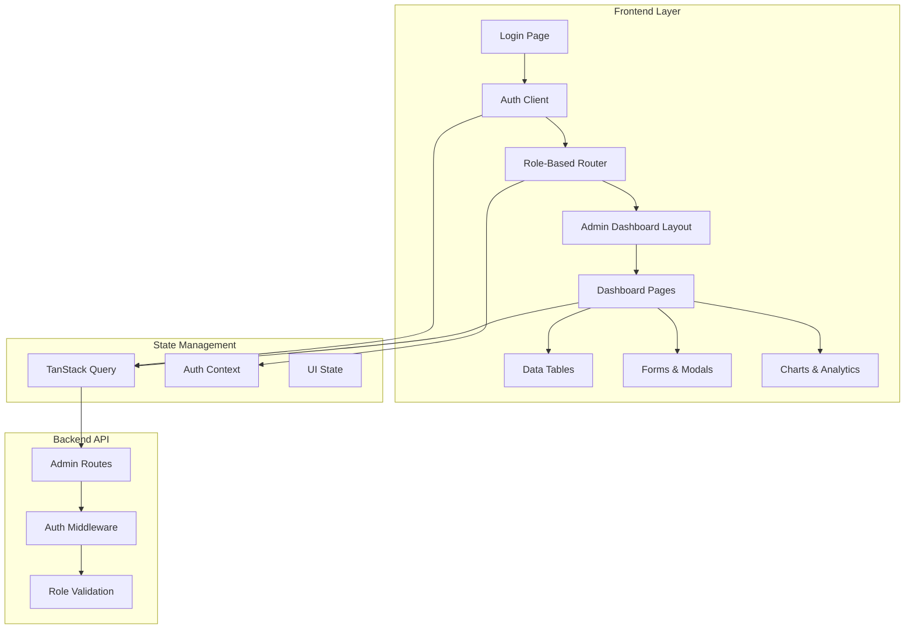
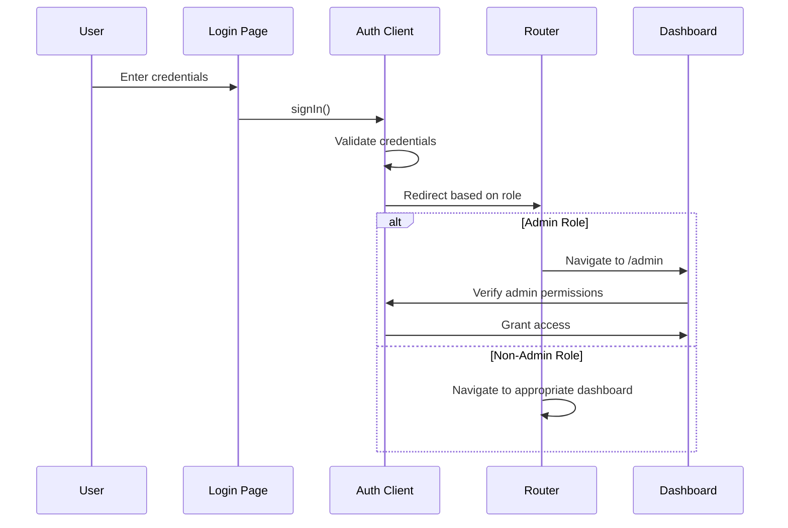

# Design Document: Admin Dashboard

## Overview

The Admin Dashboard is a comprehensive administrative interface for the lawyer onboarding platform that provides role-based access to manage users, applications, communications, and platform analytics. The dashboard leverages modern React technologies including TanStack Router, TanStack Query, TanStack Table, and ShadCN UI components to deliver a responsive and efficient user experience.

The system implements a single login flow with post-authentication role-based redirection, ensuring that admin users (reviewer, admin, super_admin) are automatically directed to the appropriate administrative interface while maintaining security through both frontend and backend validation.

## Architecture

### High-Level Architecture



### Component Architecture

The admin dashboard follows a hierarchical component structure:

1. **Layout Components**: Provide consistent structure and navigation
2. **Page Components**: Handle specific administrative functions
3. **Feature Components**: Reusable components for common admin tasks
4. **UI Components**: ShadCN UI components for consistent styling

### Authentication Flow



## Components and Interfaces

### Core Layout Components

#### AdminLayout
```typescript
interface AdminLayoutProps {
  children: React.ReactNode;
}

// Provides the main admin dashboard layout with sidebar navigation
// Handles role verification and unauthorized access redirection
// Integrates with existing protected route structure
```

#### AdminSidebar
```typescript
interface AdminSidebarProps {
  currentPath: string;
  userRole: 'reviewer' | 'admin' | 'super_admin';
}

// Navigation sidebar with role-based menu items
// Uses ShadCN UI components for consistent styling
// Supports collapsible navigation for mobile responsiveness
```

#### AdminHeader
```typescript
interface AdminHeaderProps {
  user: User;
  onLogout: () => void;
}

// Header component with user information and logout functionality
// Displays current admin user details and role
// Provides quick access to user settings and logout
```

### Page Components

#### DashboardOverview
```typescript
interface DashboardOverviewProps {
  metrics: DashboardMetrics;
  recentActivity: ActivityItem[];
  isLoading: boolean;
}

interface DashboardMetrics {
  totalUsers: number;
  totalApplications: number;
  pendingApplications: number;
  approvedApplications: number;
  rejectedApplications: number;
}

// Main dashboard page displaying key metrics and recent activity
// Uses TanStack Query for data fetching and caching
// Implements auto-refresh functionality for real-time updates
```

#### ApplicationManagement
```typescript
interface ApplicationManagementProps {
  applications: Application[];
  pagination: PaginationInfo;
  filters: ApplicationFilters;
  onFilterChange: (filters: ApplicationFilters) => void;
}

interface ApplicationFilters {
  status?: 'pending' | 'approved' | 'rejected';
  country?: string;
  state?: string;
  dateFrom?: string;
  dateTo?: string;
  query?: string;
}

// Application review and management interface
// Uses TanStack Table for data display with sorting and filtering
// Provides bulk operations for application approval/rejection
```

#### UserManagement
```typescript
interface UserManagementProps {
  users: User[];
  userType: 'all' | 'lawyers' | 'clients';
  pagination: PaginationInfo;
  filters: UserFilters;
}

interface UserFilters {
  query?: string;
  status?: 'active' | 'banned';
  country?: string;
  userType?: 'client' | 'lawyer';
}

// User account management interface
// Supports filtering by user type (lawyers/clients)
// Provides user status management (suspend/reactivate/flag)
```

### Data Table Components

#### AdminDataTable
```typescript
interface AdminDataTableProps<T> {
  data: T[];
  columns: ColumnDef<T>[];
  pagination: PaginationInfo;
  sorting: SortingState;
  filtering: FilteringState;
  onPaginationChange: (pagination: PaginationInfo) => void;
  onSortingChange: (sorting: SortingState) => void;
  onFilteringChange: (filtering: FilteringState) => void;
  isLoading?: boolean;
  bulkActions?: BulkAction<T>[];
}

// Generic data table component using TanStack Table
// Supports server-side pagination, sorting, and filtering
// Implements bulk selection and operations
// Uses ShadCN UI table components for consistent styling
```

#### ApplicationTable
```typescript
interface ApplicationTableProps {
  applications: Application[];
  onApprove: (id: string, notes: string) => void;
  onReject: (id: string, reason: string, feedback: string) => void;
  onViewDetails: (id: string) => void;
}

// Specialized table for application management
// Provides inline actions for approve/reject operations
// Displays application status with visual indicators
```

### Form Components

#### ApplicationReviewForm
```typescript
interface ApplicationReviewFormProps {
  application: Application;
  onApprove: (notes: string) => void;
  onReject: (reason: string, feedback: string) => void;
  onCancel: () => void;
}

// Form for reviewing individual applications
// Uses ShadCN form components with validation
// Provides rich text editing for review notes and feedback
```

#### UserStatusForm
```typescript
interface UserStatusFormProps {
  user: User;
  onUpdateStatus: (status: UserStatus, reason: string, banExpires?: string) => void;
  onCancel: () => void;
}

interface UserStatus {
  action: 'suspend' | 'reactivate' | 'flag';
  reason: string;
  banExpires?: string;
}

// Form for updating user account status
// Includes date picker for ban expiration
// Validates required fields based on action type
```

### Analytics Components

#### MetricsCard
```typescript
interface MetricsCardProps {
  title: string;
  value: number;
  icon: React.ReactNode;
  trend?: {
    value: number;
    direction: 'up' | 'down';
    period: string;
  };
  color: 'blue' | 'green' | 'yellow' | 'red' | 'purple';
}

// Reusable metrics display card
// Shows key performance indicators with trend information
// Uses consistent color coding for different metric types
```

#### ActivityFeed
```typescript
interface ActivityFeedProps {
  activities: ActivityItem[];
  isLoading: boolean;
  onLoadMore?: () => void;
}

interface ActivityItem {
  id: string;
  type: string;
  description: string;
  userId: string;
  userName: string;
  createdAt: string;
  metadata?: Record<string, any>;
}

// Real-time activity feed component
// Displays recent platform activities with user context
// Supports infinite scrolling for historical activities
```

## Data Models

### User Models

```typescript
interface User {
  id: string;
  name: string;
  email: string;
  image?: string;
  role: 'user' | 'reviewer' | 'admin' | 'super_admin';
  createdAt: string;
  updatedAt: string;
  status: 'active' | 'banned' | 'flagged';
  lastLoginAt?: string;
}

interface AdminUser extends User {
  role: 'reviewer' | 'admin' | 'super_admin';
  permissions: Permission[];
}

interface Permission {
  resource: string;
  actions: string[];
}
```

### Application Models

```typescript
interface Application {
  id: string;
  lawyerId: string;
  lawyerName: string;
  lawyerEmail: string;
  status: 'pending' | 'approved' | 'rejected';
  submittedAt: string;
  reviewedAt?: string;
  reviewerId?: string;
  reviewerName?: string;
  reviewNotes?: string;
  rejectionReason?: string;
  rejectionFeedback?: string;
  documents: Document[];
  specializations: Specialization[];
  practiceInfo: PracticeInfo;
}

interface PracticeInfo {
  phoneNumber: string;
  country: string;
  state: string;
  yearsOfExperience: number;
  barLicenseNumber: string;
  barAssociation: string;
  licenseStatus: string;
  experienceDescription?: string;
}
```

### API Response Models

```typescript
interface ApiResponse<T = unknown> {
  success: boolean;
  message?: string;
  data?: T;
  error?: string;
  code?: string;
  details?: string;
}

interface PaginatedResponse<T> {
  success: boolean;
  data: {
    items: T[];
    pagination: {
      page: number;
      limit: number;
      total: number;
      totalPages: number;
    };
  };
  searchType?: 'basic' | 'advanced';
}
```

### State Management Models

```typescript
interface AdminDashboardState {
  currentUser: AdminUser | null;
  selectedFilters: Record<string, any>;
  bulkSelection: string[];
  uiState: {
    sidebarCollapsed: boolean;
    activeModal: string | null;
    loadingStates: Record<string, boolean>;
  };
}

interface QueryKeys {
  dashboard: ['admin', 'dashboard'];
  applications: ['admin', 'applications', ApplicationFilters];
  users: ['admin', 'users', UserFilters];
  statistics: ['admin', 'statistics', StatisticsParams];
}
```

## Correctness Properties

*A property is a characteristic or behavior that should hold true across all valid executions of a system-essentially, a formal statement about what the system should do. Properties serve as the bridge between human-readable specifications and machine-verifiable correctness guarantees.*

### Property Reflection

After analyzing all acceptance criteria, I identified several areas where properties can be consolidated:

- Authentication and authorization properties can be combined into comprehensive access control properties
- UI component properties can be grouped by technology stack (TanStack Table, ShadCN UI)
- Form validation properties share common patterns and can be unified
- Data display properties follow similar patterns across different views

### Authentication and Authorization Properties

**Property 1: Admin role-based redirection**
*For any* user with role 'admin', 'reviewer', or 'super_admin', successful login should redirect to the admin dashboard
**Validates: Requirements 1.1**

**Property 2: Non-admin access control**
*For any* user without admin privileges, attempting to access admin routes should redirect to an unauthorized page
**Validates: Requirements 1.2**

**Property 3: Session expiration handling**
*For any* admin user with an expired session, accessing admin functions should redirect to the login page
**Validates: Requirements 1.3, 9.4**

**Property 4: Dual-layer role verification**
*For any* admin route access, the system should verify user roles on both frontend and backend layers
**Validates: Requirements 1.5**

### Dashboard and Data Display Properties

**Property 5: Dashboard metrics completeness**
*For any* admin dashboard load, the display should include total users, total applications, pending applications, approved applications, and rejected applications
**Validates: Requirements 2.1, 2.2**

**Property 6: Activity feed presence**
*For any* dashboard load, the system should display a recent activity feed component
**Validates: Requirements 2.3**

**Property 7: Automatic refresh behavior**
*For any* dashboard session, metrics should refresh automatically every 5 minutes
**Validates: Requirements 2.4**

**Property 8: Error message display**
*For any* failed API call, the system should display user-friendly error messages
**Validates: Requirements 2.5, 8.2**

### Application Management Properties

**Property 9: Application list features**
*For any* application management view, the system should provide pagination and search functionality
**Validates: Requirements 3.1**

**Property 10: Application filtering capabilities**
*For any* application search, the system should support filtering by status, country, state, date range, and reviewer
**Validates: Requirements 3.2**

**Property 11: Application detail navigation**
*For any* application item clicked, the system should display detailed application information
**Validates: Requirements 3.3**

**Property 12: Application review actions**
*For any* application review interface, the system should provide approve and reject actions with required notes
**Validates: Requirements 3.4**

**Property 13: Bulk operation confirmation**
*For any* bulk operation, the system should require confirmation and display progress feedback
**Validates: Requirements 3.5, 4.5, 8.3, 9.2**

**Property 14: Advanced search functionality**
*For any* application search, the system should support searching across lawyer name, email, and bar license number fields
**Validates: Requirements 3.6**

**Property 15: Filter preset functionality**
*For any* saved filter preset, the system should allow quick application of the filter combination
**Validates: Requirements 3.7**

### User Management Properties

**Property 16: User view filtering**
*For any* user management interface, the system should provide separate views for all users, lawyers only, and clients only
**Validates: Requirements 4.1**

**Property 17: User account actions**
*For any* user account management, the system should provide suspend, reactivate, and flag options
**Validates: Requirements 4.2**

**Property 18: User status update validation**
*For any* user status update, the system should require a reason and optionally accept ban expiration dates
**Validates: Requirements 4.3**

**Property 19: User detail completeness**
*For any* user detail view, the system should display complete profile information and associated data
**Validates: Requirements 4.4**

**Property 20: Super admin profile editing**
*For any* super admin user profile update, the system should allow modification of name, email, and role fields
**Validates: Requirements 4.6**

### Analytics and Statistics Properties

**Property 21: Statistics configuration options**
*For any* statistics view, the system should provide configurable date ranges and grouping options
**Validates: Requirements 5.1**

**Property 22: Analytics data completeness**
*For any* analytics display, the system should show user registration trends, application patterns, approval/rejection rates, and activity metrics
**Validates: Requirements 5.2, 5.3**

**Property 23: Data export functionality**
*For any* data export request, the system should provide CSV, Excel, and PDF format options
**Validates: Requirements 5.4**

**Property 24: Report customization**
*For any* report generation, the system should allow filtering and customization of included data
**Validates: Requirements 5.5**

### Communication Properties

**Property 25: Notification template selection**
*For any* notification sending interface, the system should provide template selection and personalization options
**Validates: Requirements 6.1, 6.5**

**Property 26: Bulk communication targeting**
*For any* bulk communication, the system should support user targeting based on criteria
**Validates: Requirements 6.2**

**Property 27: Communication history display**
*For any* communication history view, the system should display sent messages with delivery status
**Validates: Requirements 6.3, 6.4**

### UI and Technology Stack Properties

**Property 28: Responsive design behavior**
*For any* screen size change, the interface should adapt effectively for desktop and tablet devices
**Validates: Requirements 7.3**

**Property 29: TanStack Table implementation**
*For any* data table display, the system should use TanStack Table with sorting, pagination, and column customization features
**Validates: Requirements 7.4, 11.2**

**Property 30: ShadCN UI consistency**
*For any* user interface element, the system should use ShadCN UI components for consistent styling
**Validates: Requirements 7.5, 11.3**

**Property 31: Breadcrumb navigation**
*For any* multi-step process, the system should provide breadcrumb navigation
**Validates: Requirements 7.6**

### Form Validation Properties

**Property 32: Required field validation**
*For any* form submission, the system should validate all required fields before allowing submission
**Validates: Requirements 8.1**

**Property 33: Loading state indicators**
*For any* long-running operation, the system should provide loading states and progress indicators
**Validates: Requirements 8.4**

**Property 34: Validation error guidance**
*For any* validation error, the system should highlight specific fields and provide clear guidance
**Validates: Requirements 8.5**

**Property 35: ShadCN form implementation**
*For any* form component, the system should use ShadCN form components with proper validation
**Validates: Requirements 11.4**

### Security and Audit Properties

**Property 36: Administrative action logging**
*For any* administrative action, the system should log the action with user identification and timestamps
**Validates: Requirements 9.1**

**Property 37: CSRF protection and input sanitization**
*For any* form submission, the system should implement CSRF protection and input sanitization
**Validates: Requirements 9.3**

**Property 38: Audit trail access**
*For any* super admin user, the system should provide audit trail viewing functionality
**Validates: Requirements 9.5**

### Performance Properties

**Property 39: Page load performance**
*For any* dashboard page load, the system should display initial content within 2 seconds
**Validates: Requirements 10.1**

**Property 40: Efficient data handling**
*For any* large dataset, the system should implement efficient pagination and lazy loading
**Validates: Requirements 10.2**

**Property 41: Data caching**
*For any* frequently accessed data, the system should implement caching to improve performance
**Validates: Requirements 10.3**

**Property 42: Search debouncing**
*For any* search input, the system should provide real-time results with debounced input
**Validates: Requirements 10.4**

### Technology Stack Properties

**Property 43: TanStack Query implementation**
*For any* API operation, the system should use TanStack Query for data fetching, caching, and mutations
**Validates: Requirements 11.1, 11.5**

## Error Handling

The admin dashboard implements comprehensive error handling strategies:

### API Error Handling
- Network failures are handled with retry logic and user-friendly messages
- Authentication errors trigger automatic logout and redirect to login
- Permission errors display appropriate unauthorized access messages
- Validation errors are displayed with specific field highlighting

### UI Error Boundaries
- React error boundaries catch and display component-level errors
- Fallback UI components provide graceful degradation
- Error reporting includes user context and action history

### Form Validation
- Client-side validation provides immediate feedback
- Server-side validation ensures data integrity
- Progressive enhancement allows basic functionality without JavaScript

## Testing Strategy

The admin dashboard testing strategy employs both unit tests and property-based tests for comprehensive coverage:

### Unit Testing
- **Component Testing**: Test individual components with React Testing Library
- **Integration Testing**: Test component interactions and data flow
- **API Testing**: Mock API responses and test error scenarios
- **Authentication Testing**: Test role-based access and session management

### Property-Based Testing
- **Minimum 100 iterations** per property test for thorough coverage
- **TanStack Query Integration**: Test caching and synchronization behavior
- **Form Validation**: Test validation rules across various input combinations
- **Access Control**: Test role-based permissions with generated user scenarios

### Testing Configuration
- Use **Vitest** as the test runner (already configured in package.json)
- Use **@testing-library/react** for component testing
- Use **MSW (Mock Service Worker)** for API mocking
- Each property test tagged with: **Feature: admin-dashboard, Property {number}: {property_text}**

### Test Organization
```
src/
├── components/
│   ├── admin/
│   │   ├── __tests__/
│   │   │   ├── AdminLayout.test.tsx
│   │   │   ├── AdminDataTable.test.tsx
│   │   │   └── AdminDashboard.properties.test.tsx
├── pages/
│   ├── admin/
│   │   ├── __tests__/
│   │   │   ├── ApplicationManagement.test.tsx
│   │   │   └── UserManagement.properties.test.tsx
```

The dual testing approach ensures both specific functionality (unit tests) and universal correctness (property tests) are validated, providing confidence in the admin dashboard's reliability and maintainability.