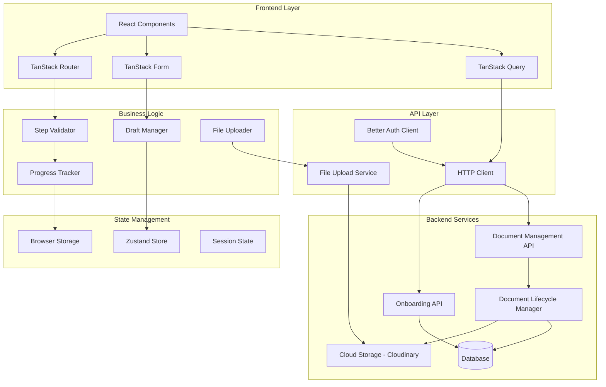
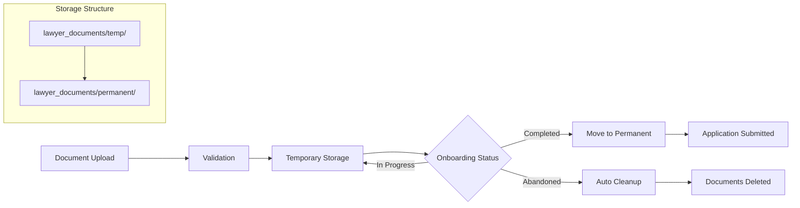

# Design Document

## Overview

This design enhances the existing lawyer onboarding system by transforming it from a basic 3-step form into a comprehensive, production-ready onboarding flow. The enhancement leverages the existing TanStack Router architecture while adding robust step validation, progress tracking, auto-save functionality, and complete API integration.

The design maintains the current React + TanStack ecosystem (Router, Query, Form) while introducing new patterns for multi-step form management, file upload handling, and application state tracking.

## Architecture

### High-Level Architecture



### Enhanced Route Structure

The design extends the existing route structure with proper step validation and navigation control:

```
/onboarding/lawyer/
├── route.tsx (Layout with progress tracking)
├── basics.tsx (Step 1 - Enhanced)
├── credentials.tsx (Step 2 - Enhanced) 
├── specializations.tsx (Step 3 - New)
├── review.tsx (Step 4 - New)
└── status.tsx (Post-submission status)
```

## Components and Interfaces

### Core Components

#### 1. Enhanced Step Navigator
```typescript
interface StepNavigatorProps {
  currentStep: OnboardingStep;
  completedSteps: OnboardingStep[];
  onStepChange: (step: OnboardingStep) => void;
  allowSkipping?: boolean;
}

interface StepValidationResult {
  isValid: boolean;
  errors: ValidationError[];
  canProceed: boolean;
}
```

The Step Navigator manages progression between onboarding steps with validation rules:
- Prevents navigation to incomplete steps
- Displays progress visually with completion indicators
- Handles step validation before allowing progression
- Integrates with TanStack Router for URL-based navigation

#### 2. Progress Tracker Component
```typescript
interface ProgressTrackerProps {
  steps: StepDefinition[];
  currentStep: OnboardingStep;
  completedSteps: OnboardingStep[];
  estimatedTimeRemaining?: number;
}

interface StepDefinition {
  id: OnboardingStep;
  title: string;
  description: string;
  estimatedMinutes: number;
  required: boolean;
}
```

The Progress Tracker provides visual feedback and time estimation:
- Shows completion percentage and visual progress bar
- Displays step descriptions and requirements
- Calculates estimated time remaining based on current progress
- Persists progress state across browser sessions

#### 3. Enhanced File Uploader
```typescript
interface FileUploaderProps {
  acceptedTypes: string[];
  maxSize: number;
  maxFiles: number;
  onUploadProgress: (progress: UploadProgress) => void;
  onUploadComplete: (files: UploadedFile[]) => void;
  onUploadError: (error: UploadError) => void;
  existingFiles?: UploadedFile[];
}

interface UploadProgress {
  fileId: string;
  fileName: string;
  progress: number; // 0-100
  status: 'uploading' | 'completed' | 'error' | 'cancelled';
}
```

The File Uploader handles document submission with enhanced UX:
- Drag-and-drop support with visual feedback
- Progress tracking with cancellation capability
- File validation (type, size, format) before upload
- Preview generation and individual file replacement
- Integration with cloud storage services

#### 4. Draft Manager Hook
```typescript
interface UseDraftManagerOptions {
  stepId: OnboardingStep;
  autoSaveInterval?: number; // milliseconds
  onSave?: (data: any) => void;
  onRestore?: (data: any) => void;
}

interface DraftManagerReturn {
  saveDraft: (data: any) => void;
  restoreDraft: () => any | null;
  clearDraft: () => void;
  hasUnsavedChanges: boolean;
  lastSaved: Date | null;
}
```

The Draft Manager provides auto-save functionality:
- Automatic saving every 30 seconds during form editing
- Manual save triggers on field blur events
- Draft restoration when returning to incomplete steps
- Clear indication of unsaved changes
- Sync with backend when connectivity is restored

### API Integration Layer

#### Enhanced API Client
```typescript
interface OnboardingAPIClient {
  // Status and navigation
  getOnboardingStatus(): Promise<OnboardingStatusResponse>;
  
  // Step-specific endpoints
  savePracticeInfo(data: PracticeInfoInput): Promise<ApiResponse>;
  saveDocuments(data: DocumentsInput): Promise<ApiResponse>;
  completeOnboarding(data: CompleteOnboardingInput): Promise<ApiResponse>;
  
  // Secure document upload endpoints
  uploadDocument(file: File, type: DocumentType): Promise<UploadResponse>;
  getDocuments(): Promise<DocumentsResponse>;
  deleteDocument(documentId: string): Promise<ApiResponse>;
  cleanupOnboarding(): Promise<ApiResponse>;
  
  // Specializations
  getSpecializations(): Promise<SpecializationsResponse>;
}

interface DocumentUploadResponse {
  success: boolean;
  data?: {
    id: string;
    url: string;
    publicId: string;
    fileName: string;
    fileSize: number;
    uploadedAt: string;
    status: 'temporary' | 'permanent';
  };
  error?: string;
}

interface ApiResponse<T = any> {
  success: boolean;
  data?: T;
  error?: string;
  code?: string;
  details?: string;
}
```

The API client handles all backend communication with proper error handling and retry logic.

## Data Models

### Enhanced Onboarding State
```typescript
interface LawyerOnboardingState {
  // Navigation state
  currentStep: OnboardingStep;
  completedSteps: OnboardingStep[];
  canAccessStep: (step: OnboardingStep) => boolean;
  
  // Form data (existing + new)
  practiceInfo: PracticeInfoData;
  documents: DocumentData[];
  specializations: SpecializationData[];
  
  // UI state
  isLoading: boolean;
  errors: Record<string, string[]>;
  hasUnsavedChanges: boolean;
  lastSaved: Date | null;
  
  // Progress tracking
  progressPercentage: number;
  estimatedTimeRemaining: number;
  
  // Application status
  applicationStatus: ApplicationStatus;
  submissionDate?: Date;
  referenceNumber?: string;
}

type OnboardingStep = 
  | 'practice_info' 
  | 'documents' 
  | 'specializations' 
  | 'review' 
  | 'submitted';

type ApplicationStatus = 
  | 'draft' 
  | 'in_progress' 
  | 'submitted' 
  | 'under_review' 
  | 'approved' 
  | 'rejected';
```

### Enhanced File Upload Data Models
```typescript
interface DocumentData {
  id: string;
  type: DocumentType;
  originalName: string;
  url: string;
  publicId: string;
  fileSize: number;
  uploadProgress?: number;
  uploadStatus: 'pending' | 'uploading' | 'completed' | 'error';
  storageStatus: 'temporary' | 'permanent';
  uploadedAt: Date;
  validationErrors?: string[];
}

interface UploadedFile {
  id: string;
  name: string;
  size: number;
  type: string;
  url: string;
  publicId: string;
  uploadedAt: Date;
  storageStatus: 'temporary' | 'permanent';
  metadata?: {
    userId: string;
    documentType: DocumentType;
    auditTrail: AuditEntry[];
  };
}

interface DocumentLifecycleState {
  temporaryDocuments: DocumentData[];
  permanentDocuments: DocumentData[];
  pendingCleanup: string[];
  lastCleanupCheck: Date;
}

type DocumentType = 
  | 'bar_certificate' 
  | 'law_degree' 
  | 'professional_license' 
  | 'malpractice_insurance' 
  | 'identification';

interface AuditEntry {
  action: 'upload' | 'move_to_permanent' | 'delete' | 'cleanup';
  timestamp: Date;
  userId: string;
  details?: string;
}
```

### Specialization Data Models
```typescript
interface SpecializationData {
  specializationId: string;
  yearsOfExperience: number;
  description?: string;
}

interface SpecializationOption {
  id: string;
  name: string;
  description: string;
  category: string;
  requirements?: string[];
}
```

## Document Lifecycle Management

### Storage Architecture

The secure document upload system implements a two-tier storage approach with automatic lifecycle management:



### Security and Isolation Features

**File Validation**:
- Type validation: PDF, JPEG, PNG, GIF, WebP only
- Size limits: 10MB maximum per document
- Content validation to prevent malicious uploads
- Metadata extraction and sanitization

**User Isolation**:
- Documents stored with user-specific paths
- Access control prevents cross-user document access
- Authentication required for all document operations
- Audit trail for all document lifecycle events

**Transaction Safety**:
- Database and cloud storage operations are transactional
- Rollback capability for failed operations
- Consistency checks between database records and cloud files
- Automatic cleanup of orphaned files

### API Endpoints Integration

**Document Upload**: `POST /api/lawyers/upload-document`
- Multipart form data support
- Real-time progress tracking
- Immediate validation and feedback
- Temporary storage with metadata recording

**Document Management**: `GET /api/lawyers/documents`
- Retrieve user's documents with status
- Filter by storage status (temporary/permanent)
- Include upload progress and validation status

**Document Deletion**: `DELETE /api/lawyers/documents/:id`
- Owner validation before deletion
- Cleanup from both database and cloud storage
- Audit trail recording

**Onboarding Cleanup**: `DELETE /api/lawyers/onboarding/cleanup`
- Complete cleanup of abandoned onboarding
- Removes profile and all temporary documents
- Cannot cleanup completed applications
- Transaction safety with rollback

### Environment Configuration

Required environment variables for Cloudinary integration:
```
CLOUDINARY_CLOUD_NAME=your-cloud-name
CLOUDINARY_API_KEY=your-api-key
CLOUDINARY_API_SECRET=your-api-secret
```

## Correctness Properties

*A property is a characteristic or behavior that should hold true across all valid executions of a system-essentially, a formal statement about what the system should do. Properties serve as the bridge between human-readable specifications and machine-verifiable correctness guarantees.*

<function_calls>
<invoke name="prework">
<parameter name="featureName">lawyer-onboarding-enhancement

### Property Reflection

After analyzing all acceptance criteria, I identified several areas where properties can be consolidated to eliminate redundancy:

**Navigation and Validation Properties**: Properties 1.1 and 1.2 are complementary (blocking vs allowing navigation) and can be combined into a comprehensive navigation control property.

**Progress Persistence Properties**: Properties 2.1 and 2.2 both deal with persistence and can be combined into a single round-trip property.

**Error Handling Properties**: Properties 3.1, 3.2, and 3.5 all deal with error display and can be consolidated into a comprehensive error handling property.

**File Upload Properties**: Properties 4.1, 4.2, 4.3, and 4.4 cover the complete upload lifecycle and can be combined into fewer, more comprehensive properties.

**Draft Management Properties**: Properties 6.1, 6.2, and 6.3 all deal with draft state management and can be consolidated.

### Converting EARS to Properties

Based on the prework analysis, here are the consolidated correctness properties:

**Property 1: Step Navigation Control**
*For any* onboarding step and user progress state, navigation to a step should be allowed if and only if all prerequisite steps are completed and valid
**Validates: Requirements 1.1, 1.2**

**Property 2: Progress State Persistence**
*For any* progress state, saving then restoring should produce an equivalent progress state with all completion status preserved
**Validates: Requirements 2.1, 2.2**

**Property 3: Progress Display Consistency**
*For any* progress state, the visual indicators should accurately reflect completed, current, and remaining steps with correct time estimates
**Validates: Requirements 2.3, 2.4**

**Property 4: Comprehensive Error Handling**
*For any* validation failure or server error, the system should display appropriate error messages in the correct location with proper prioritization
**Validates: Requirements 3.1, 3.2, 3.5**

**Property 5: Offline Form Editing**
*For any* network interruption, form editing should continue to work and sync changes when connectivity is restored
**Validates: Requirements 3.3, 6.5**

**Property 6: Validation Success Feedback**
*For any* successful validation, the system should provide positive feedback and clear all previous error states
**Validates: Requirements 3.4**

**Property 7: File Upload Validation**
*For any* file upload attempt, validation should occur before upload and reject files that don't meet type, size, or format requirements
**Validates: Requirements 4.1**

**Property 8: Upload Progress and Control**
*For any* file upload in progress, the system should display accurate progress indicators and allow cancellation
**Validates: Requirements 4.2**

**Property 9: Upload Completion Handling**
*For any* completed file upload, the system should show previews and allow individual file replacement without affecting other files
**Validates: Requirements 4.3**

**Property 10: Upload Error Recovery**
*For any* failed file upload, the system should preserve all other form data and allow retry without data loss
**Validates: Requirements 4.4**

**Property 11: Drag-Drop File Support**
*For any* file upload interface, drag-and-drop should work with multiple file selection and proper visual feedback
**Validates: Requirements 4.5**

**Property 31: Document Lifecycle Transition**
*For any* completed onboarding process, all documents should be moved from temporary to permanent storage automatically
**Validates: Requirements 4.6, 11.2**

**Property 32: Abandoned Document Cleanup**
*For any* abandoned or incomplete onboarding process, all temporary documents should be automatically cleaned up
**Validates: Requirements 4.7, 11.3**

**Property 33: Document User Isolation**
*For any* document access attempt, users should only be able to access their own documents and be prevented from accessing other users' files
**Validates: Requirements 4.8, 11.6**

**Property 34: Document Transaction Safety**
*For any* document operation failure, the system should maintain transaction safety with proper rollback capability
**Validates: Requirements 4.9, 11.5**

**Property 35: Document Audit Trail**
*For any* document storage operation, the system should maintain complete audit trail with timestamps, file types, and operation details
**Validates: Requirements 4.10, 11.7**

**Property 36: Document API Endpoint Usage**
*For any* document upload operation, the system should use POST /api/lawyers/upload-document with proper multipart form data
**Validates: Requirements 8.6**

**Property 37: Document Deletion API Usage**
*For any* document deletion operation, the system should use DELETE /api/lawyers/documents/:id with proper owner validation
**Validates: Requirements 8.7**

**Property 38: Onboarding Cleanup API Usage**
*For any* onboarding cleanup operation, the system should use DELETE /api/lawyers/onboarding/cleanup for abandoned applications
**Validates: Requirements 8.8**

**Property 39: Document Operation Error Handling**
*For any* document operation error, the system should provide proper error handling and user feedback
**Validates: Requirements 8.9**

**Property 40: Document Storage Sync**
*For any* document lifecycle event, the system should maintain sync between database records and cloud storage files
**Validates: Requirements 8.10, 11.8**

**Property 41: Temporary Storage Location**
*For any* document upload, documents should be stored in temporary storage (lawyer_documents/temp/) with proper user isolation
**Validates: Requirements 11.1**

**Property 42: Complete Cleanup Coverage**
*For any* document cleanup operation, files should be removed from both database and cloud storage completely
**Validates: Requirements 11.4**

**Property 12: Specialization Search and Filter**
*For any* specialization search query, the results should include all matching practice areas with proper filtering
**Validates: Requirements 5.1**

**Property 13: Specialization Selection Limits**
*For any* specialization selection attempt, the system should enforce minimum 1 and maximum 5 selections
**Validates: Requirements 5.2**

**Property 14: Experience Input Validation**
*For any* selected specialization, years of experience input should be required and validated as non-negative integers
**Validates: Requirements 5.3, 5.5**

**Property 15: Selection Summary Display**
*For any* specialization selection combination, the summary should show descriptions and requirements for all selected areas
**Validates: Requirements 5.4**

**Property 16: Draft Auto-Save and Restore**
*For any* form editing session, changes should auto-save every 30 seconds and restore completely when returning to incomplete steps
**Validates: Requirements 6.1, 6.2**

**Property 17: Draft State Indication**
*For any* draft state, the system should display clear indicators of unsaved changes and last saved time
**Validates: Requirements 6.3**

**Property 18: Draft Cleanup on Completion**
*For any* successfully completed step, the draft data for that step should be cleared immediately
**Validates: Requirements 6.4**

**Property 19: Application Status Display**
*For any* application state, the dashboard should show current status with accurate information
**Validates: Requirements 7.2**

**Property 20: Status Change Updates**
*For any* status change event, the display should update immediately to reflect the new status
**Validates: Requirements 7.3**

**Property 21: Rejection Handling**
*For any* rejected application, the system should provide a resubmission flow with clear feedback
**Validates: Requirements 7.4**

**Property 22: API Endpoint Selection**
*For any* step submission, the system should use the correct PATCH/POST endpoint for that specific step
**Validates: Requirements 8.2**

**Property 23: API Response Handling**
*For any* API response, the system should handle the documented response formats and error codes correctly
**Validates: Requirements 8.3**

**Property 24: Authentication Token Inclusion**
*For any* authenticated request, the system should include proper session tokens in the request headers
**Validates: Requirements 8.4**

**Property 25: API Retry Logic**
*For any* failed API call, the system should implement retry mechanisms with exponential backoff
**Validates: Requirements 8.5**

**Property 26: Responsive Design Adaptation**
*For any* screen size, the progress indicators and forms should adapt responsively with proper touch support on mobile
**Validates: Requirements 9.1, 9.2**

**Property 27: Accessibility Compliance**
*For any* form element, the system should maintain proper accessibility with screen readers and keyboard navigation
**Validates: Requirements 9.3, 9.4**

**Property 28: Layout Overflow Handling**
*For any* content size, the system should provide appropriate scrolling and layout adjustments
**Validates: Requirements 9.5**

**Property 29: UI Responsiveness During Operations**
*For any* background operation (upload, save), the UI should remain responsive and show appropriate loading indicators
**Validates: Requirements 10.3, 10.5**

**Property 30: Non-Blocking Validation**
*For any* form validation, feedback should be immediate without blocking user input
**Validates: Requirements 10.4**

## Error Handling

### Error Classification and Handling Strategy

**Client-Side Validation Errors**:
- Field-level validation with immediate feedback
- Form-level validation before step progression
- Clear error messages with suggested corrections
- Error state clearing when validation passes

**Network and Connectivity Errors**:
- Offline mode with queued operations
- Automatic retry with exponential backoff
- Connection status indicators
- Graceful degradation of functionality

**Server-Side Errors**:
- User-friendly error message translation
- Specific error codes mapped to actionable guidance
- Fallback error handling for unexpected responses
- Error logging for debugging and monitoring

**File Upload Errors**:
- Pre-upload validation to prevent common errors
- Progress tracking with error state handling
- Individual file error handling without affecting others
- Retry mechanisms for failed uploads

### Error Recovery Patterns

**Progressive Enhancement**:
- Core functionality works without JavaScript
- Enhanced features degrade gracefully
- Offline capabilities with sync on reconnection

**State Recovery**:
- Auto-save prevents data loss during errors
- Draft restoration after error recovery
- Progress state persistence across sessions

## Testing Strategy

### Dual Testing Approach

The testing strategy employs both unit tests and property-based tests to ensure comprehensive coverage:

**Unit Tests**:
- Specific examples and edge cases
- Integration points between components
- Error conditions and boundary cases
- User interaction flows

**Property-Based Tests**:
- Universal properties across all inputs
- Comprehensive input coverage through randomization
- Validation of correctness properties defined in this document
- Minimum 100 iterations per property test

### Property-Based Testing Configuration

**Testing Framework**: Use `fast-check` for TypeScript property-based testing
**Test Configuration**:
- Minimum 100 iterations per property test
- Custom generators for onboarding data structures
- Shrinking enabled for minimal counterexamples

**Test Tagging Format**:
Each property test must include a comment referencing its design document property:
```typescript
// Feature: lawyer-onboarding-enhancement, Property 1: Step Navigation Control
```

### Testing Priorities

1. **Critical Path Testing**: Step navigation and validation logic
2. **Data Integrity Testing**: Draft management and persistence
3. **API Integration Testing**: Backend communication and error handling
4. **File Upload Testing**: Upload progress, validation, and error recovery
5. **Accessibility Testing**: Keyboard navigation and screen reader support
6. **Performance Testing**: Load times and UI responsiveness

### Test Data Generation

**Smart Generators**:
- Valid onboarding state generators with realistic constraints
- File upload generators with various file types and sizes
- API response generators covering success and error scenarios
- User interaction sequence generators for workflow testing

**Edge Case Coverage**:
- Boundary conditions for file sizes and validation limits
- Network interruption scenarios
- Concurrent user actions and race conditions
- Browser storage limitations and cleanup

The testing strategy ensures that both specific examples work correctly (unit tests) and that universal properties hold across all possible inputs (property tests), providing comprehensive validation of the enhanced onboarding system.