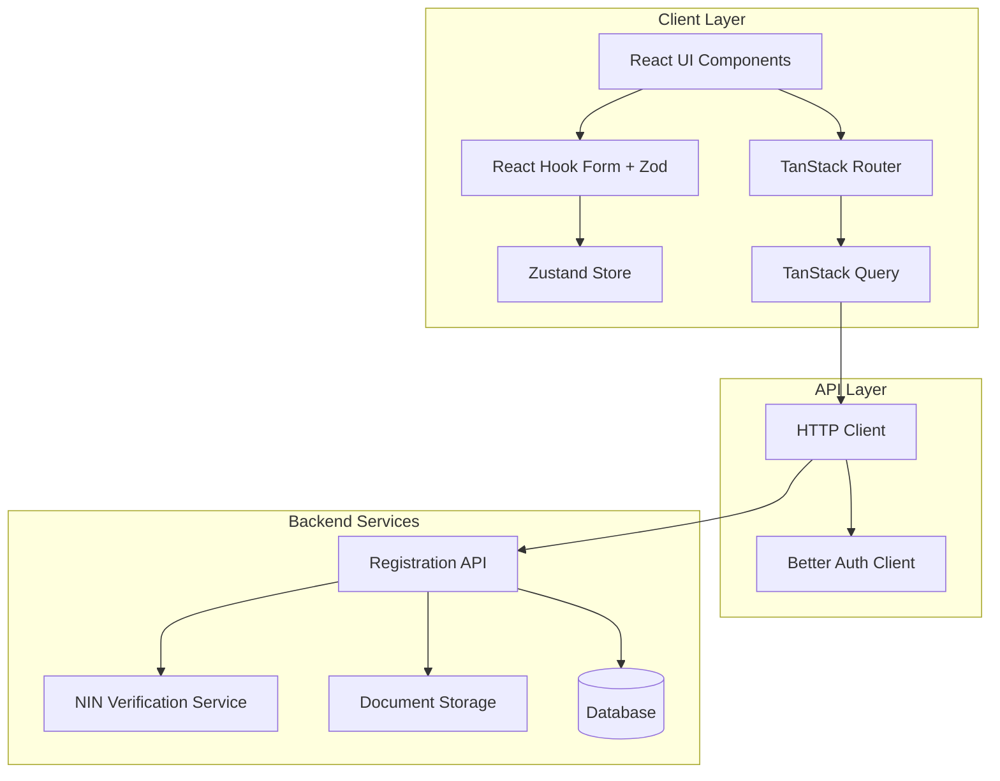
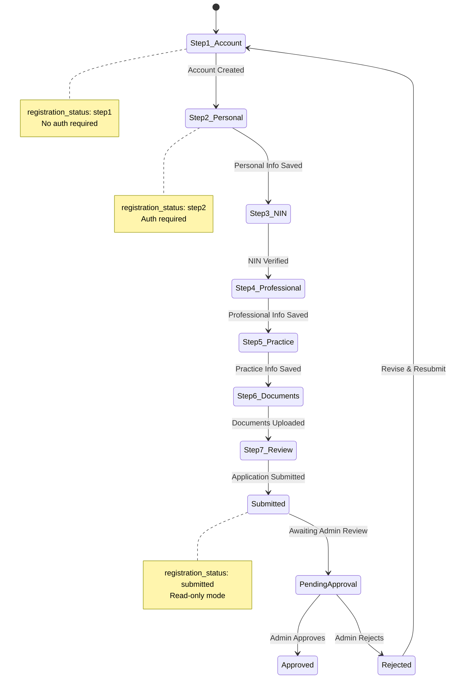

# Design Document: 7-Step Lawyer Registration System

## Overview

This design document specifies the architecture and implementation details for a comprehensive 7-step lawyer registration and onboarding system. The system replaces the current simplified 2-step flow with a robust, stateful registration process that includes identity verification, credential validation, document uploads, and administrative approval workflows.

The system is built using:
- **TanStack Router** for routing and navigation with type-safe route parameters
- **React Hook Form** with **Zod** for form validation
- **Zustand** for client-side state management
- **Better Auth** for authentication
- **TanStack Query** for server state management and caching
- **React** 19 with TypeScript for the UI layer

## Architecture

### High-Level Architecture



### Registration Flow State Machine



### Route Structure

The registration system uses TanStack Router with the following route hierarchy:

```
/register
  /step1 (or /account)          - Account Creation
  /step2 (or /personal-info)    - Personal Information
  /step3 (or /nin-verification) - NIN Verification
  /step4 (or /professional-info)- Professional Information
  /step5 (or /practice-info)    - Practice Information
  /step6 (or /documents)        - Document Upload
  /step7 (or /review)           - Review & Submit
```

Each route will:
1. Check authentication status (except step1)
2. Fetch current `registration_status` from backend
3. Redirect to correct step if user is on wrong step
4. Pre-fill form data from backend if available
5. Handle "Save & Continue" and "Save & Exit" actions

## Components and Interfaces

### Core Components

#### 1. Registration Layout Component

Wraps all registration steps with common UI elements:

```typescript
interface RegistrationLayoutProps {
  currentStep: number;
  totalSteps: number;
  children: React.ReactNode;
}

// Features:
// - Progress bar showing step X of 7
// - Step indicators with checkmarks for completed steps
// - Responsive container
// - Consistent styling across all steps
```

#### 2. Step Form Components

Each step has a dedicated form component:

```typescript
// Step 1: Account Creation Form
interface AccountCreationFormData {
  email: string;
  password: string;
  confirmPassword: string;
  phoneNumber: string;
}

// Step 2: Personal Information Form
interface PersonalInfoFormData {
  firstName: string;
  lastName: string;
  middleName?: string;
  dateOfBirth: Date;
  gender: 'male' | 'female' | 'other' | 'prefer_not_to_say';
  state: string;
  lga: string;
}

// Step 3: NIN Verification Form
interface NINVerificationFormData {
  nin: string;
  consent: boolean; // NDPR consent checkbox
}

interface NINVerificationResult {
  firstName: string;
  middleName: string;
  lastName: string;
  image: string; // Base64 encoded image
  dateOfBirth: string;
  gender: string;
  mobile: string;
  address: {
    addressLine: string;
    town: string;
    lga: string;
    state: string;
  };
  idNumber: string;
}

// Step 4: Professional Information Form
interface ProfessionalInfoFormData {
  barNumber: string;
  yearOfCall: number;
  lawSchool: string;
  university: string;
  llbYear: number;
}

// Step 5: Practice Information Form
interface PracticeInfoFormData {
  practiceType: 'solo' | 'firm';
  firmName?: string;
  practiceAreas: string[]; // Array of practice area IDs
  statesOfPractice: string[];
  officeAddress: string;
  officeCity: string;
  officeState: string;
}

// Step 6: Document Upload Form
interface DocumentUploadFormData {
  callToBarCertificate: File | null;
  llbCertificate: File | null;
  passportPhoto: File | null;
}

interface UploadedDocument {
  id: string;
  type: 'call_to_bar' | 'llb_certificate' | 'passport_photo';
  url: string;
  publicId: string;
  originalName: string;
  preview?: string;
}

// Step 7: Review Summary (read-only)
interface RegistrationSummary {
  account: {
    email: string;
    phone: string;
  };
  personal: PersonalInfoFormData;
  ninVerified: boolean;
  professional: ProfessionalInfoFormData;
  practice: PracticeInfoFormData;
  documents: UploadedDocument[];
}
```

#### 3. Form Action Buttons Component

Reusable component for "Save & Continue" and "Save & Exit" buttons:

```typescript
interface FormActionsProps {
  onSaveAndContinue: () => void;
  onSaveAndExit: () => void;
  isSubmitting: boolean;
  isSaveAndContinueDisabled?: boolean;
}
```

#### 4. Progress Indicator Component

Visual progress tracking:

```typescript
interface ProgressIndicatorProps {
  steps: Array<{
    number: number;
    label: string;
    completed: boolean;
    current: boolean;
  }>;
}
```

### State Management

#### Zustand Store Structure

```typescript
interface RegistrationStore {
  // Current registration status
  registrationStatus: RegistrationStatus;
  
  // Form data for each step (cached locally)
  step1Data: Partial<AccountCreationFormData>;
  step2Data: Partial<PersonalInfoFormData>;
  step3Data: Partial<NINVerificationFormData>;
  step4Data: Partial<ProfessionalInfoFormData>;
  step5Data: Partial<PracticeInfoFormData>;
  step6Data: Partial<DocumentUploadFormData>;
  
  // NIN verification result
  ninVerificationResult: NINVerificationResult | null;
  
  // Actions
  setRegistrationStatus: (status: RegistrationStatus) => void;
  updateStep1Data: (data: Partial<AccountCreationFormData>) => void;
  updateStep2Data: (data: Partial<PersonalInfoFormData>) => void;
  updateStep3Data: (data: Partial<NINVerificationFormData>) => void;
  updateStep4Data: (data: Partial<ProfessionalInfoFormData>) => void;
  updateStep5Data: (data: Partial<PracticeInfoFormData>) => void;
  updateStep6Data: (data: Partial<DocumentUploadFormData>) => void;
  setNINVerificationResult: (result: NINVerificationResult | null) => void;
  clearRegistrationData: () => void;
  
  // Persistence
  hydrateFromLocalStorage: () => void;
  persistToLocalStorage: () => void;
}

type RegistrationStatus = 
  | 'step1' 
  | 'step2' 
  | 'step3' 
  | 'step4' 
  | 'step5' 
  | 'step6' 
  | 'step7' 
  | 'submitted' 
  | 'approved' 
  | 'rejected';
```

The Zustand store will:
- Persist to localStorage on every update
- Hydrate from localStorage on app initialization
- Clear localStorage when registration is submitted
- Provide type-safe access to registration data across components

### API Integration Layer

#### Registration API Service

```typescript
interface RegistrationAPI {
  // Step 1: Account Creation
  createAccount(data: AccountCreationFormData): Promise<{
    success: boolean;
    lawyer_id: string;
    token: string;
    registration_status: RegistrationStatus;
  }>;
  
  // Step 2: Personal Information
  getPersonalInfo(): Promise<PersonalInfoFormData | null>;
  savePersonalInfo(data: PersonalInfoFormData): Promise<{
    success: boolean;
    registration_status: RegistrationStatus;
  }>;
  
  // Step 3: NIN Verification
  verifyNIN(nin: string, consent: boolean): Promise<{
    success: boolean;
    data: NINVerificationResult;
  }>;
  confirmNIN(nin: string): Promise<{
    success: boolean;
    registration_status: RegistrationStatus;
  }>;
  
  // Step 4: Professional Information
  getProfessionalInfo(): Promise<ProfessionalInfoFormData | null>;
  saveProfessionalInfo(data: ProfessionalInfoFormData): Promise<{
    success: boolean;
    registration_status: RegistrationStatus;
  }>;
  
  // Step 5: Practice Information
  getPracticeInfo(): Promise<PracticeInfoFormData | null>;
  savePracticeInfo(data: PracticeInfoFormData): Promise<{
    success: boolean;
    registration_status: RegistrationStatus;
  }>;
  
  // Step 6: Document Upload
  uploadDocuments(data: FormData): Promise<{
    success: boolean;
    documents: UploadedDocument[];
    registration_status: RegistrationStatus;
  }>;
  
  // Step 7: Review & Submit
  getRegistrationSummary(): Promise<{
    success: boolean;
    data: RegistrationSummary;
  }>;
  submitApplication(): Promise<{
    success: boolean;
    message: string;
    application_id: string;
  }>;
  
  // Status Check
  getRegistrationStatus(): Promise<{
    success: boolean;
    registration_status: RegistrationStatus;
  }>;
}
```

#### TanStack Query Hooks

```typescript
// Query hooks for data fetching
function useRegistrationStatus() {
  return useQuery({
    queryKey: ['registration', 'status'],
    queryFn: () => registrationAPI.getRegistrationStatus(),
    staleTime: 0, // Always fetch fresh status
  });
}

function usePersonalInfo() {
  return useQuery({
    queryKey: ['registration', 'step2'],
    queryFn: () => registrationAPI.getPersonalInfo(),
    enabled: false, // Only fetch when explicitly called
  });
}

function useProfessionalInfo() {
  return useQuery({
    queryKey: ['registration', 'step4'],
    queryFn: () => registrationAPI.getProfessionalInfo(),
    enabled: false,
  });
}

function usePracticeInfo() {
  return useQuery({
    queryKey: ['registration', 'step5'],
    queryFn: () => registrationAPI.getPracticeInfo(),
    enabled: false,
  });
}

function useRegistrationSummary() {
  return useQuery({
    queryKey: ['registration', 'summary'],
    queryFn: () => registrationAPI.getRegistrationSummary(),
    enabled: false,
  });
}

// Mutation hooks for data submission
function useCreateAccount() {
  return useMutation({
    mutationFn: (data: AccountCreationFormData) => 
      registrationAPI.createAccount(data),
    onSuccess: (response) => {
      // Store token and lawyer_id
      localStorage.setItem('lawyer_token', response.token);
      localStorage.setItem('lawyer_id', response.lawyer_id);
    },
  });
}

function useSavePersonalInfo() {
  const queryClient = useQueryClient();
  return useMutation({
    mutationFn: (data: PersonalInfoFormData) => 
      registrationAPI.savePersonalInfo(data),
    onSuccess: () => {
      queryClient.invalidateQueries({ queryKey: ['registration', 'step2'] });
    },
  });
}

function useVerifyNIN() {
  return useMutation({
    mutationFn: ({ nin, consent }: { nin: string; consent: boolean }) => 
      registrationAPI.verifyNIN(nin, consent),
  });
}

function useConfirmNIN() {
  return useMutation({
    mutationFn: (nin: string) => registrationAPI.confirmNIN(nin),
  });
}

function useSaveProfessionalInfo() {
  const queryClient = useQueryClient();
  return useMutation({
    mutationFn: (data: ProfessionalInfoFormData) => 
      registrationAPI.saveProfessionalInfo(data),
    onSuccess: () => {
      queryClient.invalidateQueries({ queryKey: ['registration', 'step4'] });
    },
  });
}

function useSavePracticeInfo() {
  const queryClient = useQueryClient();
  return useMutation({
    mutationFn: (data: PracticeInfoFormData) => 
      registrationAPI.savePracticeInfo(data),
    onSuccess: () => {
      queryClient.invalidateQueries({ queryKey: ['registration', 'step5'] });
    },
  });
}

function useUploadDocuments() {
  return useMutation({
    mutationFn: (formData: FormData) => 
      registrationAPI.uploadDocuments(formData),
  });
}

function useSubmitApplication() {
  return useMutation({
    mutationFn: () => registrationAPI.submitApplication(),
    onSuccess: () => {
      // Clear local storage
      localStorage.removeItem('registration_draft');
    },
  });
}
```

## Data Models

### Database Schema (Backend)

```typescript
// Lawyer Registration Table
interface LawyerRegistration {
  id: string; // UUID
  user_id: string; // Foreign key to auth users table
  
  // Step 1: Account
  email: string;
  phone_number: string;
  
  // Step 2: Personal Info
  first_name: string;
  last_name: string;
  middle_name?: string;
  date_of_birth: Date;
  gender: 'male' | 'female' | 'other' | 'prefer_not_to_say';
  state: string;
  lga: string;
  
  // Step 3: NIN Verification
  nin: string;
  nin_verified: boolean;
  nin_verification_data?: {
    photo: string;
    full_name: string;
    date_of_birth: string;
  };
  nin_verified_at?: Date;
  
  // Step 4: Professional Info
  bar_number: string;
  year_of_call: number;
  law_school: string;
  university: string;
  llb_year: number;
  
  // Step 5: Practice Info
  practice_type: 'solo' | 'firm';
  firm_name?: string;
  practice_areas: string[]; // Array of practice area IDs
  states_of_practice: string[];
  office_address: string;
  office_city: string;
  office_state: string;
  
  // Step 6: Documents
  documents: Array<{
    id: string;
    type: 'call_to_bar' | 'llb_certificate' | 'passport_photo';
    url: string;
    public_id: string;
    original_name: string;
    uploaded_at: Date;
  }>;
  
  // Registration Status
  registration_status: RegistrationStatus;
  
  // Step 7: Submission
  submitted_at?: Date;
  application_id?: string;
  
  // Admin Review
  reviewed_by?: string; // Admin user ID
  reviewed_at?: Date;
  review_notes?: string;
  approval_status?: 'pending' | 'approved' | 'rejected';
  
  // Timestamps
  created_at: Date;
  updated_at: Date;
}

// Practice Areas Reference Table
interface PracticeArea {
  id: string;
  name: string;
  description?: string;
  created_at: Date;
}

// States and LGAs Reference Table
interface StateData {
  code: string;
  name: string;
  lgas: Array<{
    code: string;
    name: string;
  }>;
}
```

### Validation Schemas (Zod)

```typescript
// Step 1: Account Creation
const accountCreationSchema = z.object({
  email: z.string()
    .email('Invalid email format')
    .min(1, 'Email is required'),
  password: z.string()
    .min(8, 'Password must be at least 8 characters')
    .regex(/[0-9]/, 'Password must contain at least one number')
    .regex(/[^a-zA-Z0-9]/, 'Password must contain at least one special character'),
  confirmPassword: z.string()
    .min(1, 'Please confirm your password'),
  phoneNumber: z.string()
    .regex(/^\+[1-9]\d{1,14}$/, 'Invalid phone number format (must include country code)'),
}).refine((data) => data.password === data.confirmPassword, {
  message: 'Passwords do not match',
  path: ['confirmPassword'],
});

// Step 2: Personal Information
const personalInfoSchema = z.object({
  firstName: z.string()
    .min(1, 'First name is required')
    .max(100, 'First name is too long'),
  lastName: z.string()
    .min(1, 'Last name is required')
    .max(100, 'Last name is too long'),
  middleName: z.string()
    .max(100, 'Middle name is too long')
    .optional(),
  dateOfBirth: z.date()
    .refine((date) => {
      const age = new Date().getFullYear() - date.getFullYear();
      return age >= 18;
    }, 'You must be at least 18 years old'),
  gender: z.enum(['male', 'female', 'other', 'prefer_not_to_say']),
  state: z.string()
    .min(1, 'State is required'),
  lga: z.string()
    .min(1, 'LGA is required'),
});

// Step 3: NIN Verification
const ninVerificationSchema = z.object({
  nin: z.string()
    .length(11, 'NIN must be exactly 11 digits')
    .regex(/^\d{11}$/, 'NIN must contain only numbers'),
  consent: z.boolean()
    .refine((val) => val === true, {
      message: 'You must consent to NDPR terms to verify your NIN',
    }),
});

// Step 4: Professional Information
const professionalInfoSchema = z.object({
  barNumber: z.string()
    .min(1, 'Bar number is required'),
  yearOfCall: z.number()
    .int('Year must be a whole number')
    .min(1950, 'Year of call seems too old')
    .max(new Date().getFullYear(), 'Year of call cannot be in the future'),
  lawSchool: z.string()
    .min(1, 'Law school is required'),
  university: z.string()
    .min(1, 'University is required'),
  llbYear: z.number()
    .int('Year must be a whole number')
    .min(1950, 'Graduation year seems too old')
    .max(new Date().getFullYear(), 'Graduation year cannot be in the future'),
}).refine((data) => data.yearOfCall >= data.llbYear, {
  message: 'Year of call must be after or equal to LLB graduation year',
  path: ['yearOfCall'],
});

// Step 5: Practice Information
const practiceInfoSchema = z.object({
  practiceType: z.enum(['solo', 'firm']),
  firmName: z.string().optional(),
  practiceAreas: z.array(z.string())
    .min(1, 'Select at least one practice area'),
  statesOfPractice: z.array(z.string())
    .min(1, 'Select at least one state of practice'),
  officeAddress: z.string()
    .min(1, 'Office address is required'),
  officeCity: z.string()
    .min(1, 'Office city is required'),
  officeState: z.string()
    .min(1, 'Office state is required'),
}).refine((data) => {
  if (data.practiceType === 'firm') {
    return data.firmName && data.firmName.length > 0;
  }
  return true;
}, {
  message: 'Firm name is required when practice type is Law Firm',
  path: ['firmName'],
});

// Step 6: Document Upload
const documentUploadSchema = z.object({
  callToBarCertificate: z.instanceof(File)
    .refine((file) => file.size <= 2 * 1024 * 1024, 'File size must be less than 2MB')
    .refine((file) => {
      const validTypes = ['application/pdf', 'image/jpeg', 'image/png', 'image/webp'];
      return validTypes.includes(file.type);
    }, 'File must be PDF or image (JPEG, PNG, WebP)'),
  llbCertificate: z.instanceof(File)
    .refine((file) => file.size <= 2 * 1024 * 1024, 'File size must be less than 2MB')
    .refine((file) => {
      const validTypes = ['application/pdf', 'image/jpeg', 'image/png', 'image/webp'];
      return validTypes.includes(file.type);
    }, 'File must be PDF or image (JPEG, PNG, WebP)'),
  passportPhoto: z.instanceof(File)
    .refine((file) => file.size <= 5 * 1024 * 1024, 'File size must be less than 5MB')
    .refine((file) => {
      const validTypes = ['image/jpeg', 'image/png', 'image/webp'];
      return validTypes.includes(file.type);
    }, 'File must be an image (JPEG, PNG, WebP)'),
});
```


## Correctness Properties

*A property is a characteristic or behavior that should hold true across all valid executions of a system—essentially, a formal statement about what the system should do. Properties serve as the bridge between human-readable specifications and machine-verifiable correctness guarantees.*

### Form Validation Properties

**Property 1: Email validation correctness**
*For any* string input to the email field, the validation should pass if and only if the string matches valid email format (contains @ symbol, valid domain structure).
**Validates: Requirements 1.1**

**Property 2: Password strength validation**
*For any* string input to the password field, the validation should pass if and only if the string has at least 8 characters, contains at least one number, and contains at least one special character.
**Validates: Requirements 1.2**

**Property 3: Password confirmation matching**
*For any* two password strings, the confirmation validation should pass if and only if both strings are identical.
**Validates: Requirements 1.3**

**Property 4: Phone number format validation**
*For any* string input to the phone number field, the validation should pass if and only if the string matches the pattern +[country code][number] with valid length.
**Validates: Requirements 1.4**

**Property 5: Age validation from date of birth**
*For any* date of birth input, the validation should pass if and only if the calculated age is at least 18 years.
**Validates: Requirements 2.3**

**Property 6: NIN format validation**
*For any* string input to the NIN field, the validation should pass if and only if the string is exactly 11 characters and contains only numeric digits.
**Validates: Requirements 3.1**

**Property 6a: NIN consent validation**
*For any* NIN verification attempt, the validation should pass if and only if the consent checkbox is checked (value is true).
**Validates: Requirements 3.2, 3.3**

**Property 7: Year ordering validation**
*For any* pair of years (year of call, LLB graduation year), the validation should pass if and only if year of call is greater than or equal to LLB graduation year.
**Validates: Requirements 4.3**

**Property 8: Future date prevention**
*For any* year input, the validation should pass if and only if the year is less than or equal to the current year.
**Validates: Requirements 4.4**

**Property 9: Conditional firm name validation**
*For any* practice information form, if practice type is "firm" then firm name must be non-empty, and if practice type is "solo" then firm name is optional.
**Validates: Requirements 5.2, 5.3**

**Property 10: Array minimum length validation**
*For any* multi-select field (practice areas, states of practice), the validation should pass if and only if at least one item is selected.
**Validates: Requirements 5.4, 5.5**

**Property 11: File type validation for certificates**
*For any* file uploaded as a certificate (Call to Bar, LLB), the validation should pass if and only if the file type is one of: application/pdf, image/jpeg, image/png, image/webp.
**Validates: Requirements 6.1, 6.2**

**Property 12: File type validation for passport photo**
*For any* file uploaded as a passport photo, the validation should pass if and only if the file type is one of: image/jpeg, image/png, image/webp.
**Validates: Requirements 6.3**

**Property 13: File size validation for certificates**
*For any* file uploaded as a certificate, the validation should pass if and only if the file size is less than or equal to 2MB.
**Validates: Requirements 6.4**

**Property 14: File size validation for passport photo**
*For any* file uploaded as a passport photo, the validation should pass if and only if the file size is less than or equal to 5MB.
**Validates: Requirements 6.5**

**Property 15: Document completeness validation**
*For any* document upload form submission, the validation should pass if and only if all three required documents (Call to Bar Certificate, LLB Certificate, Passport Photo) have been uploaded.
**Validates: Requirements 6.7**

### State Management Properties

**Property 16: Registration status progression**
*For any* successful step completion, the registration_status should be updated to the next sequential step (step1 → step2 → step3 → step4 → step5 → step6 → step7 → submitted).
**Validates: Requirements 1.7, 2.6, 3.8, 4.6, 5.8, 6.9, 7.11**

**Property 17: Step navigation after completion**
*For any* successful step submission, the system should navigate to the next step in the sequence.
**Validates: Requirements 1.8, 2.7, 3.9, 4.7, 5.9, 6.10, 7.12**

**Property 18: Data persistence round-trip**
*For any* form data saved to the backend, when the user returns to that step, the form should be pre-filled with the exact same data that was saved.
**Validates: Requirements 9.5, 9.6**

**Property 19: Status-based navigation enforcement**
*For any* registration_status value, when a user attempts to access a step, they should be redirected to the correct step corresponding to their status if they attempt to skip ahead.
**Validates: Requirements 8.3, 9.2, 10.3**

**Property 20: Backward navigation allowance**
*For any* completed step (step number less than current registration_status), the user should be able to navigate to that step.
**Validates: Requirements 8.4**

**Property 21: Local storage cleanup on submission**
*For any* successful application submission, all locally stored draft data should be cleared from localStorage.
**Validates: Requirements 9.7**

### API Integration Properties

**Property 22: Form submission triggers API call**
*For any* valid form submission on steps 1-6, the corresponding API endpoint should be called with the form data.
**Validates: Requirements 1.5, 2.5, 3.2, 3.6, 4.5, 5.7, 6.8, 7.9**

**Property 23: Page load triggers data fetch**
*For any* navigation to steps 2, 4, 5, or 7, the corresponding GET API endpoint should be called to retrieve previously saved data.
**Validates: Requirements 2.1, 4.1, 5.1, 7.1**

**Property 24: Status check on page load**
*For any* page load in the registration flow, the system should call GET /api/register/status to retrieve the current registration_status.
**Validates: Requirements 9.1, 10.2**

**Property 25: Token storage on account creation**
*For any* successful account creation response containing lawyer_id and token, both values should be stored in browser storage.
**Validates: Requirements 1.6**

### UI Behavior Properties

**Property 26: Loading indicator during async operations**
*For any* pending API request, a loading indicator should be displayed until the request completes.
**Validates: Requirements 3.3**

**Property 27: NIN verification result display**
*For any* successful NIN verification response, the UI should display the image, full name (firstName + middleName + lastName), date of birth, and address from the response.
**Validates: Requirements 3.4**

**Property 28: Name mismatch warning**
*For any* NIN verification result where the NIN name does not match the Step 2 name, a mismatch warning should be displayed.
**Validates: Requirements 3.5**

**Property 29: File preview display**
*For any* uploaded file, a preview of the file should be displayed in the UI.
**Validates: Requirements 6.6**

**Property 30: Summary completeness**
*For any* registration summary data, the rendered UI should contain all required sections: account information (email, phone), personal information (name, DOB, gender, state, LGA), NIN verification status, professional information (bar number, education), practice information (firm, areas, locations), and uploaded documents with previews.
**Validates: Requirements 7.2, 7.3, 7.4, 7.5, 7.6, 7.7**

**Property 31: Edit buttons presence**
*For any* section in the summary view, an "Edit" button should be present that links back to the corresponding step.
**Validates: Requirements 7.8**

**Property 32: Progress bar accuracy**
*For any* current step number, the progress bar should display "Step X of 7" where X matches the current step.
**Validates: Requirements 8.1**

**Property 33: Step indicator checkmarks**
*For any* set of completed steps, checkmarks should be displayed on the step indicators for all steps with numbers less than the current step.
**Validates: Requirements 8.2**

**Property 34: Action buttons presence**
*For any* registration step (1-6), both "Save & Continue" and "Save & Exit" buttons should be present in the UI.
**Validates: Requirements 8.5**

**Property 35: Save and continue behavior**
*For any* valid form state, clicking "Save & Continue" should validate the form, save the data, and navigate to the next step.
**Validates: Requirements 8.6**

**Property 36: Save and exit behavior**
*For any* form state, clicking "Save & Exit" should save the current form data and navigate to the dashboard.
**Validates: Requirements 8.7**

### Error Handling Properties

**Property 37: Field-level error display**
*For any* field validation error, an error message should be displayed adjacent to the specific field that failed validation.
**Validates: Requirements 11.1**

**Property 38: API error message display**
*For any* failed API request, a clear error message should be displayed to the user.
**Validates: Requirements 11.2, 11.5**

**Property 39: Network error retry option**
*For any* network error, a retry option should be available in the UI.
**Validates: Requirements 11.3**

**Property 40: Session timeout redirect**
*For any* session timeout error, the system should redirect to the login page with a timeout message.
**Validates: Requirements 11.4**

**Property 41: Rejection error handling**
*For any* NIN verification rejection (user clicks "Not Me"), an error message should be displayed and the NIN input field should be enabled for re-entry.
**Validates: Requirements 3.7**

### Authentication and Authorization Properties

**Property 42: Authentication guard for protected steps**
*For any* attempt to access steps 2-7 without authentication, the system should redirect to the login page.
**Validates: Requirements 10.1**

**Property 43: Status-based redirection for submitted applications**
*For any* registration_status value of "submitted", navigation should redirect to the Pending Approval dashboard.
**Validates: Requirements 9.3**

**Property 44: Status-based redirection for approved applications**
*For any* registration_status value of "approved", navigation should redirect to the main dashboard.
**Validates: Requirements 9.4**

**Property 45: Success message on submission**
*For any* successful application submission, a success message should be displayed to the user.
**Validates: Requirements 7.10**

### Accessibility Properties

**Property 46: ARIA labels on inputs**
*For any* input field in the registration forms, an ARIA label attribute should be present.
**Validates: Requirements 12.4**

### Dependent Dropdown Properties

**Property 47: LGA population based on state**
*For any* state selection, the LGA dropdown should be populated with only the LGAs that belong to the selected state.
**Validates: Requirements 2.4**

## Error Handling

### Error Categories

The system handles four main categories of errors:

1. **Validation Errors**: Client-side form validation failures
2. **API Errors**: Backend service errors (4xx, 5xx responses)
3. **Network Errors**: Connection failures, timeouts
4. **Authentication Errors**: Session expiration, unauthorized access

### Error Handling Strategy

#### Validation Errors

Field-level validation errors are displayed inline next to the specific field using React Hook Form's error state. Each error message is clear and actionable.

#### API Errors

API errors are caught by TanStack Query mutations and displayed to users with user-friendly messages. Technical error details are logged for debugging.

#### Network Errors

Network errors trigger automatic retry with exponential backoff (handled by the API client). Users are shown a retry button for manual retry attempts.

#### Authentication Errors

Session timeout errors (401 responses) clear local auth state and redirect to the login page with an appropriate message.

### Error Recovery Patterns

1. **Automatic Retry**: Network errors automatically retry with exponential backoff
2. **Manual Retry**: User-initiated retry for failed operations
3. **Graceful Degradation**: Show cached data when fresh data unavailable
4. **Error Boundaries**: Catch React errors and display fallback UI

### User-Friendly Error Messages

Technical error codes are mapped to user-friendly messages:
- `INVALID_NIN`: "The NIN you entered is invalid. Please check and try again."
- `NIN_ALREADY_REGISTERED`: "This NIN is already registered in our system."
- `FILE_TOO_LARGE`: "The file you uploaded is too large. Please upload a smaller file."
- `INVALID_FILE_TYPE`: "This file type is not supported. Please upload a PDF or image file."
- `NETWORK_ERROR`: "Unable to connect to the server. Please check your internet connection."
- `SESSION_EXPIRED`: "Your session has expired. Please log in again."

## Testing Strategy

### Testing Approach

The 7-step lawyer registration system requires comprehensive testing across multiple layers:

1. **Unit Tests**: Test individual components, validation functions, and utilities
2. **Property-Based Tests**: Verify universal properties across all inputs
3. **Integration Tests**: Test component interactions and API integration
4. **End-to-End Tests**: Test complete user flows through all 7 steps

### Unit Testing

Unit tests focus on:
- Individual form validation functions
- Zustand store actions and state updates
- Utility functions (date calculations, file size checks, etc.)
- Component rendering with specific props
- Error handling logic

**Testing Library**: Vitest + React Testing Library

Unit tests should cover specific examples and edge cases, while property-based tests handle comprehensive input coverage.

### Property-Based Testing

Property-based tests verify that correctness properties hold across many randomly generated inputs.

**Testing Library**: fast-check (JavaScript property-based testing library)

**Configuration**: Minimum 100 iterations per property test

**Tag Format**: Each property test must include a comment:
```typescript
// Feature: lawyer-registration-system, Property N: [property description]
```

**Coverage**: All 47 correctness properties must be implemented as property-based tests.

**Example Property Tests**:

```typescript
import fc from 'fast-check';

describe('Property: Email validation correctness', () => {
  it('should validate emails correctly across all inputs', () => {
    // Feature: lawyer-registration-system, Property 1: Email validation correctness
    fc.assert(
      fc.property(fc.emailAddress(), (email) => {
        const result = validateEmail(email);
        expect(result).toBe(true);
      }),
      { numRuns: 100 }
    );
  });
});

describe('Property: Registration status progression', () => {
  it('should progress status sequentially', () => {
    // Feature: lawyer-registration-system, Property 16: Registration status progression
    const statusSequence = ['step1', 'step2', 'step3', 'step4', 'step5', 'step6', 'step7', 'submitted'];
    
    fc.assert(
      fc.property(
        fc.integer({ min: 0, max: statusSequence.length - 2 }),
        (currentIndex) => {
          const currentStatus = statusSequence[currentIndex];
          const nextStatus = getNextStatus(currentStatus);
          expect(nextStatus).toBe(statusSequence[currentIndex + 1]);
        }
      ),
      { numRuns: 100 }
    );
  });
});
```

### Integration Testing

Integration tests verify:
- Form submission flows with API mocking
- Navigation between steps
- State management across components
- TanStack Query cache behavior

Use MSW (Mock Service Worker) for API mocking in integration tests.

### End-to-End Testing

E2E tests verify complete user journeys through the registration system.

**Testing Library**: Playwright

**Test Scenarios**:
1. Complete registration flow (all 7 steps)
2. Save and exit, then resume registration
3. Edit previous steps from review page
4. Error handling and recovery
5. NIN verification flow
6. Document upload flow

### Test Coverage Goals

- **Unit Tests**: 80%+ code coverage
- **Property Tests**: All 47 correctness properties implemented
- **Integration Tests**: All critical user flows covered
- **E2E Tests**: All happy paths and major error scenarios covered

### Continuous Integration

All tests run automatically on:
- Pull request creation
- Commits to main branch
- Pre-deployment checks

### Test Data Management

- Use factories for generating test data
- Mock external services (NIN verification, file storage)
- Use MSW (Mock Service Worker) for API mocking
- Maintain separate test database for integration tests

