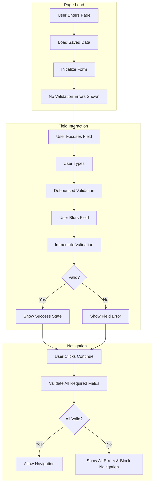

# Design Document

## Overview

This design addresses the validation timing issue in the lawyer onboarding flow by implementing proper validation triggers (blur, change, navigation) instead of immediate validation on page load. The solution maintains the existing validation logic while adding timing controls and user experience improvements.

The design focuses on modifying the existing validation system to be more user-friendly by showing errors only when appropriate, while maintaining the robust validation capabilities already in place.

## Architecture

### Current Validation Flow Issues

The current implementation has these problems:
1. Validation runs immediately when the page loads
2. All errors are displayed before user interaction
3. No debouncing for real-time validation
4. Navigation validation is mixed with display validation

### Enhanced Validation Flow



## Components and Interfaces

### Enhanced Field Validation Hook

```typescript
interface UseFieldValidationOptions {
  step: OnboardingStep;
  fieldName: string;
  value: unknown;
  state: EnhancedOnboardingState;
  validateOnMount?: boolean; // Default: false
  debounceMs?: number; // Default: 500ms
  validateOnChange?: boolean; // Default: true
  validateOnBlur?: boolean; // Default: true
}

interface FieldValidationResult {
  hasError: boolean;
  hasWarning: boolean;
  isValid: boolean;
  primaryError?: { message: string; suggestion?: string };
  successMessage?: string;
  isValidating: boolean;
  hasBeenTouched: boolean;
  shouldShowError: boolean; // Key addition - controls when to show errors
  shouldShowSuccess: boolean;
}

function useEnhancedFieldValidation(options: UseFieldValidationOptions): FieldValidationResult;
```

### Validation Timing Controller

```typescript
interface ValidationTimingState {
  touchedFields: Set<string>;
  validatingFields: Set<string>;
  hasAttemptedNavigation: boolean;
  showAllErrors: boolean;
}

class ValidationTimingController {
  private state: ValidationTimingState;
  private debounceTimers: Map<string, NodeJS.Timeout>;
  
  // Mark field as touched (user has interacted with it)
  markFieldTouched(fieldName: string): void;
  
  // Check if field errors should be shown
  shouldShowFieldError(fieldName: string): boolean;
  
  // Trigger navigation validation (shows all errors)
  triggerNavigationValidation(): void;
  
  // Reset validation state for new page
  resetValidationState(): void;
  
  // Debounced validation for real-time feedback
  scheduleValidation(fieldName: string, callback: () => void, delay: number): void;
}
```

### Enhanced Form Navigation

```typescript
interface FormNavigationOptions {
  currentStep: OnboardingStep;
  targetStep: OnboardingStep;
  validationEngine: ValidationEngine;
  onValidationFailed: (errors: ValidationError[]) => void;
  onNavigationAllowed: () => void;
}

class FormNavigationController {
  // Validate current step before allowing navigation
  async validateAndNavigate(options: FormNavigationOptions): Promise<boolean>;
  
  // Show validation errors for navigation attempt
  showNavigationErrors(errors: ValidationError[]): void;
  
  // Clear navigation-specific error states
  clearNavigationErrors(): void;
}
```

## Data Models

### Enhanced Validation State

```typescript
interface EnhancedValidationState {
  // Field-level validation state
  fieldStates: Record<string, {
    hasBeenTouched: boolean;
    isValidating: boolean;
    lastValidated: Date | null;
    validationResult: FieldValidationResult | null;
  }>;
  
  // Form-level validation state
  hasAttemptedNavigation: boolean;
  showAllErrors: boolean;
  isNavigationBlocked: boolean;
  
  // Timing controls
  debounceTimers: Record<string, NodeJS.Timeout>;
  validationMode: 'strict' | 'lenient'; // strict = show errors immediately, lenient = wait for interaction
}
```

### Validation Trigger Types

```typescript
type ValidationTrigger = 
  | 'mount'        // Page load (should not show errors)
  | 'change'       // User typing (debounced)
  | 'blur'         // User leaves field (immediate)
  | 'navigation'   // User attempts to navigate (show all errors)
  | 'manual';      // Programmatic validation

interface ValidationContext {
  trigger: ValidationTrigger;
  fieldName: string;
  step: OnboardingStep;
  showErrors: boolean;
  timestamp: Date;
}
```

## Correctness Properties

*A property is a characteristic or behavior that should hold true across all valid executions of a system-essentially, a formal statement about what the system should do. Properties serve as the bridge between human-readable specifications and machine-verifiable correctness guarantees.*

<function_calls>
<invoke name="prework">
<parameter name="featureName">validation-timing-fix

### Property Reflection

After analyzing all acceptance criteria, I identified several areas where properties can be consolidated:

**Field Interaction Properties**: Properties 1.2, 1.3, and 3.4 all deal with field interaction timing and can be combined into comprehensive field interaction properties.

**Error Display Properties**: Properties 3.1, 3.2, and 3.5 all deal with error and success state display and can be consolidated.

**Navigation Properties**: Properties 2.1, 2.2, and 2.3 all deal with navigation validation and can be combined.

### Converting EARS to Properties

Based on the prework analysis, here are the consolidated correctness properties:

**Property 1: Clean Page Load State**
*For any* onboarding page load, no validation errors should be displayed initially regardless of the data state
**Validates: Requirements 1.1**

**Property 2: Field Blur Validation**
*For any* field that has been focused and then blurred, validation should occur and errors should be displayed if the field is invalid
**Validates: Requirements 1.2**

**Property 3: Debounced Change Validation**
*For any* field being typed in, validation should occur after the user stops typing for the debounce period, but errors should not be shown until blur or navigation
**Validates: Requirements 1.3**

**Property 4: Navigation Validation Trigger**
*For any* navigation attempt, all required fields in the current step should be validated and errors should be displayed if validation fails
**Validates: Requirements 1.4, 2.1**

**Property 5: Error Clearing on Success**
*For any* field that transitions from invalid to valid, previous errors should be cleared immediately and success indicators should be shown
**Validates: Requirements 1.5, 3.5**

**Property 6: Navigation Blocking on Validation Failure**
*For any* navigation attempt with invalid required fields, navigation should be prevented and specific error messages should be displayed
**Validates: Requirements 2.2**

**Property 7: Navigation Success on Valid Data**
*For any* navigation attempt with all required fields valid, navigation should be allowed to proceed to the target step
**Validates: Requirements 2.3**

**Property 8: Clean Return to Completed Steps**
*For any* return navigation to a previously completed step, saved data should be restored without displaying validation errors initially
**Validates: Requirements 2.4**

**Property 9: Unsaved Changes Validation**
*For any* navigation attempt with unsaved changes, the current form state should be validated before allowing navigation
**Validates: Requirements 2.5**

**Property 10: Success Indicator Display**
*For any* field that passes validation after being touched, appropriate success indicators should be displayed
**Validates: Requirements 3.1**

**Property 11: Specific Error Messages**
*For any* field validation failure, specific error messages with helpful suggestions should be displayed
**Validates: Requirements 3.2**

**Property 12: Error Prioritization**
*For any* form with multiple field errors, critical errors should be displayed with higher priority than minor errors
**Validates: Requirements 3.3**

**Property 13: Debounced Error Prevention**
*For any* field being actively typed in, validation errors should not be displayed until typing stops for the debounce period
**Validates: Requirements 3.4**

## Error Handling

### Validation Error States

**Field-Level Errors**:
- Only show after user interaction (blur, navigation attempt)
- Clear immediately when field becomes valid
- Show specific, actionable error messages
- Include suggestions for fixing issues

**Form-Level Errors**:
- Show only during navigation attempts
- Prioritize critical errors over minor ones
- Provide clear indication of which fields need attention
- Allow partial completion with warnings

**Timing-Related Error Handling**:
- Debounce validation to prevent excessive API calls
- Handle race conditions in async validation
- Graceful degradation if validation service is unavailable
- Clear error states appropriately on field changes

### User Experience Error Recovery

**Progressive Disclosure**:
- Start with minimal error display
- Increase error visibility as user attempts to proceed
- Provide contextual help and suggestions
- Allow users to fix errors incrementally

**Error State Management**:
- Maintain error state across page refreshes
- Clear errors when underlying data changes
- Prevent error state inconsistencies
- Handle concurrent validation requests

## Testing Strategy

### Dual Testing Approach

The testing strategy employs both unit tests and property-based tests to ensure comprehensive coverage:

**Unit Tests**:
- Specific user interaction scenarios
- Edge cases in validation timing
- Error state transitions
- Navigation flow validation

**Property-Based Tests**:
- Universal validation timing properties
- Field interaction patterns across all form fields
- Error display consistency across different validation states
- Navigation validation across all step combinations

### Property-Based Testing Configuration

**Testing Framework**: Use `@testing-library/react` with `jest` for React component testing and `fast-check` for property-based testing
**Test Configuration**:
- Minimum 100 iterations per property test
- Custom generators for form interaction sequences
- Debounce timing validation with controlled time advancement

**Test Tagging Format**:
Each property test must include a comment referencing its design document property:
```typescript
// Feature: validation-timing-fix, Property 1: Clean Page Load State
```

### Testing Priorities

1. **Critical Path Testing**: Page load without errors, navigation validation
2. **Interaction Testing**: Field focus/blur cycles, typing patterns
3. **Timing Testing**: Debounce behavior, validation delays
4. **Error State Testing**: Error display/clearing, success indicators
5. **Navigation Testing**: Step-to-step validation, error blocking

### Test Data Generation

**Smart Generators**:
- Form interaction sequences (focus, type, blur, navigate)
- Valid and invalid field data combinations
- Timing patterns for debounced validation
- Navigation attempt scenarios with various validation states

**Edge Case Coverage**:
- Rapid field switching before validation completes
- Navigation attempts during active validation
- Page refresh during form completion
- Concurrent field validation requests

The testing strategy ensures that validation timing works correctly across all user interaction patterns while maintaining the existing validation logic integrity.